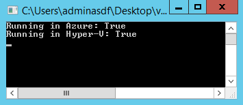

# Virtual Environment Check

This console app sample code provides some simple functions for checking if the executing code is running in Azure and/or Hyper-V.

### Azure Detection

For Azure detection, the network interfaces are enumerated and if an adapter has a DNS suffix of "cloudapp.net", it's assumed to be in Azure. Keep in mind that the internal DNS suffix is independent of the public DNS name, so it should continue to work regardless of the public domain name.

The code also detects the optional Azure guest agent. If present, it's assumed to be Azure.

### Hyper-V Detection

For Hyper-V detection, the hardware vendor is checked. This could be [expanded to check for other vendors](http://stackoverflow.com/questions/498371/how-to-detect-if-my-application-is-running-in-a-virtual-machine) such as VMWare or VirtualBox.

# License

Microsoft Developer & Platform Evangelism

Copyright (c) Microsoft Corporation. All rights reserved.

THIS CODE AND INFORMATION ARE PROVIDED "AS IS" WITHOUT WARRANTY OF ANY KIND, EITHER EXPRESSED OR IMPLIED, INCLUDING BUT NOT LIMITED TO THE IMPLIED WARRANTIES OF MERCHANTABILITY AND/OR FITNESS FOR A PARTICULAR PURPOSE.

The example companies, organizations, products, domain names, e-mail addresses, logos, people, places, and events depicted herein are fictitious. No association with any real company, organization, product, domain name, email address, logo, person, places, or events is intended or should be inferred.
